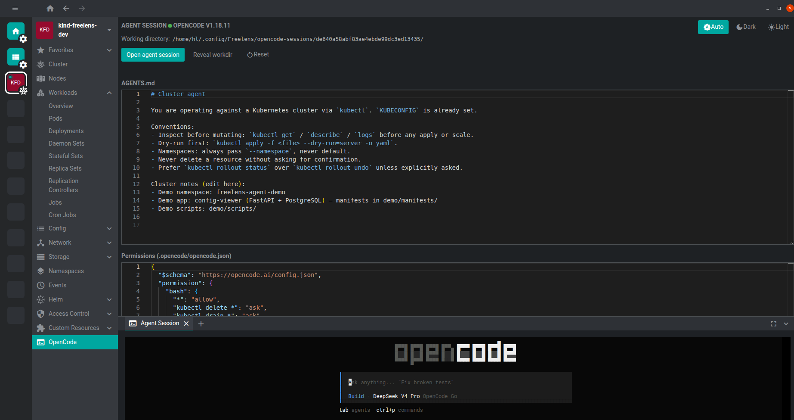
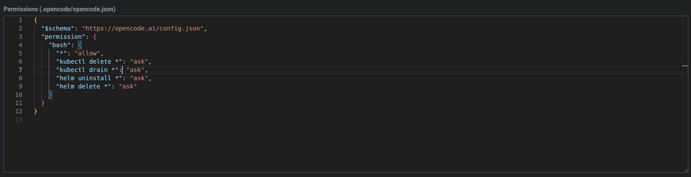

# @freelensapp/opencode-extension

[](./LICENSE)

Run an OpenCode AI agent session scoped to any Kubernetes cluster, straight
from the Freelens sidebar. One click launches `opencode` in a docked terminal
tab with `KUBECONFIG` wired, a k8s-aware harness pre-seeded, and an in-app
AGENTS.md editor.



## Why

Operating Kubernetes clusters means constant context-switching between
Freelens and a separate terminal for AI-assisted work. This extension
collapses that gap. Click **OpenCode** under any cluster and you get a
fully-provisioned opencode session inside Freelens — same KUBECONFIG, same
workspace, zero configuration.

🚀 Your agent can do literally everything you'd do with `kubectl` —
inspect, debug, deploy, scale, troubleshoot. But that's just the start.

It owns a **full workspace** where it can create manifests, write
configuration files, customize your agent, scaffold Helm charts, and architect entire complex
applications from scratch. 

Think of it as a senior DevOps engineer that
lives inside your cluster sidebar, ready to build anything you describe.
🛠️✨

## Features

- **One-click sessions** — click the sidebar entry, get a terminal dock
  tab running opencode pre-cd'd into the cluster workspace.
- **Per-cluster isolation** — each cluster gets its own workdir at
  `<userData>/opencode-sessions/<cluster-id>/`. Sessions never collide.
- **K8s-aware harness** — `AGENTS.md`, `skills`, `mcp`, `custom agents` and **any opencode feature** is
  available automatically. Editable at any time.
- **In-app AGENTS.md editor** — full editor inside Freelens with
  debounced autosave and theme matching.
- **Permission editor** — a JSON editor for `.opencode/opencode.json`
  built right into the session page. Define exactly which shell commands
  the AI agent may run with `allow`, `ask`, or `deny` rules. Ships with
  safe defaults (destructive operations require confirmation), it is scoped per cluster so production and staging clusters
  stay independently protected.


- **Pre-flight check** — probes your PATH for opencode upfront. If it's
  missing you see a clear banner with a retry button.
- **Zero bundled binary** — you install opencode once on your system; the
  extension uses it. Works on macOS, Linux, and Windows (WSL recommended).

Every feature is powered by [OpenCode](https://opencode.ai) itself — the
agentic engine that drives the AI session. This extension layers Freelens
integration on top (sidebar launch, in-app editors, KUBECONFIG wiring,
per-cluster workdirs), but permissions, skills, MCPs, custom agents, and
AGENTS.md instructions all run through OpenCode's native engine.

## Quick start

### 1. Install opencode

[Download and install opencode](https://opencode.ai/docs/) for your
platform. The extension detects it via `PATH` — it does not bundle or
update opencode.

### 2. Install the extension

Open Freelens, go to **Extensions** ... TDB

### 3. Launch a session

Click **OpenCode** in any cluster sidebar. A terminal tab opens,
navigates to the cluster workspace, and starts opencode. Repeat per
cluster — each session is independent.

## How it works

Each cluster gets a persistent workspace:

```
<userData>/opencode-sessions/<safe-cluster-id>/
  .opencode/
    opencode.json          # kubectl permission rules
  AGENTS.md                # your cluster-specific instructions
```

On first open, the extension copies a bundled scaffold into the workdir
with safe k8s defaults — all bash commands allowed by default, but
destructive operations like `kubectl delete`, `kubectl drain`, and
`helm uninstall` set to `ask` for confirmation. Open the in-app
**permission editor** to tighten or loosen these rules at any time. Each
rule maps a shell command pattern to `allow` (run silently), `ask`
(prompt the user), or `deny` (block outright). Because permissions live
per cluster, you can lock down production tightly while keeping staging
more permissive — no global config collisions.

After that the harness is yours — edit `AGENTS.md` and permissions in
the in-app editors, or reveal the workdir in your file manager
to edit everything with your own tools. Every opencode feature is
scoped to that cluster: skills, MCPs, custom instructions, agents, and
permission rules.

**Reset:** delete the `.opencode/` directory inside the workdir and
reopen the session. The scaffold re-seeds clean.

# Video demo

**The situation:**
- Pod status: `CreateContainerConfigError` (new pod can't start)

**What the agent does:**
1. `kubectl get pods, get deployments, get events` — notices `CreateContainerConfigError`
2. Reads secret key error
3. Inspects keys
4. Identifies key mismatch: `DB_PASS` should be `DB_PASSWORD`
5. Fixes and waits for pod to come back healthy

[▶️ Watch demo 1](https://github.com/freelensapp/freelens-for-opencode-extension/blob/main/docs/video/demo1.mp4?raw=true)

**The situation:**
- Pod restarts: increasing restart count

**What the agent does:**
1. `kubectl get pods -n freelens-agent-demo` — notices restarts
2. `kubectl describe pod` shows `OOMKilled` with exit code 137
3. Inspects resource limits in deployment, identifies 16Mi as insufficient
4. Recommends bumping to 256Mi
5. Fixes: applies good deployment manifest
6. Verifies pod stabilizes

[▶️ Watch demo 2](https://github.com/freelensapp/freelens-for-opencode-extension/blob/main/docs/video/demo2.mp4?raw=true)

## Developing

Dev setup, build, test, and debugging instructions live in
[CONTRIBUTING.md](./CONTRIBUTING.md).

## License

[MIT](./LICENSE) © 2025-2026 Freelens Authors
